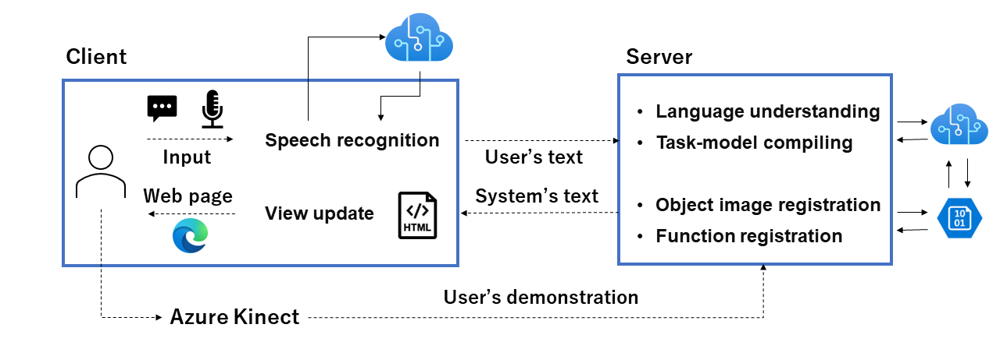
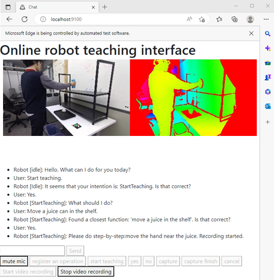

# Cohesion-based robot teaching for LfO
## About this repository
This repository provides a user interface to teach robots how to perform household manipulative operations, using the framework of [Learning-from-Observation (LfO)](https://www.microsoft.com/en-us/research/project/interactive-learning-from-observation/). The LfO project aims to generate programs for robots to execute by teaching them through multimodal instruction using language and videos. Robots perform household tasks by combining basic actions called "tasks," such as grasping, lifting, and carrying objects.

## What is Cohesion?
When instructing household tasks in language, users do not usually say "Grasp the tissue paper, lift it, carry it, and release it." Instead, they would say "Throw away the tissue paper." The concept of Cohesion serves as a bridge between the granularity of language instructions and task granularity. Cohesion is a data structure that packages the correspondence between everyday actions and task sequences ([see the cohesion file](./webapp/function_database/functions.json)). When the source code in this repository is executed, it reads the registered Cohesion from the language instructions. Detailed parameters for executing each task described in Cohesion (e.g., object name, distance moved) are obtained from the video from Azure Kinect. This teaching is achieved through interaction between the system via a browser and users. Furthermore, this repository provides functions for registering task cohesion through step-by-step instruction and collecting images associated with object names for registration in [Azure Custom Vision](https://azure.microsoft.com/en-us/products/cognitive-services/custom-vision-service/).
For more details, please refer to the following paper:
[Interactive Learning-from-Observation through multimodal human demonstration](https://arxiv.org/abs/2212.10787)

Bibliography:
```
@article{wake2022interactive,
  title={Interactive Learning-from-Observation through multimodal human demonstration},
  author={Wake, Naoki and Kanehira, Atsushi and Sasabuchi, Kazuhiro and Takamatsu, Jun and Ikeuchi, Katsushi},
  journal={arXiv preprint arXiv:2212.10787},
  year={2022}
}
```


### Overview of the pipeline:


### GUI while teaching:


## Installation
Tested with Python 3.9
```bash
pip install -r requirements.txt
```

## Preparation
* Download the latest browser drivers.
https://developer.microsoft.com/en-us/microsoft-edge/tools/webdriver/
Locate the driver in the [speech_handler](./speech_handler) folder.
Directory structure should look like this:
```bash
LfO_interface
├───speech_handler
│   │───recognizer.py
│   │───edgedriver_win64
│   │   │───msedgedriver.exe
```
You can use any browser, but you need to modify the [recognizer.py](./speech_handler/recognizer.py) to use the browser of your choice. You may need to enable long path if you are using Windows 10 or Windows 11.
[Reference](https://www.thewindowsclub.com/how-to-enable-or-disable-win32-long-paths-in-windows-11-10)

* Be sure to connect Azure Kinect DK to your computer.

* You need to prepare analyzers to compile task models.
See this [repository](https://github.com/microsoft/analyzer-for-robot-teaching-demonstrations) for reference.

* Fill in the [secrets.json](./secrets.json) with your credential information to utilize Azure.


## How to run
To run the server, in the [webapp](./webapp) folder, run:
```bash
python -m uvicorn sample:app --reload  --reload-exclude '*__init__.py' --host localhost --port 9100
```

To run the client, in the [speech_handler](./speech_handler) folder, run:
```bash
python .\recognizer.py
```

## Other useful scripts
* [recompile.py](./webapp/recompile.py)
Recompile a task model from existing data.

## Contributing

This project welcomes contributions and suggestions.  Most contributions require you to agree to a
Contributor License Agreement (CLA) declaring that you have the right to, and actually do, grant us
the rights to use your contribution. For details, visit https://cla.opensource.microsoft.com.

When you submit a pull request, a CLA bot will automatically determine whether you need to provide
a CLA and decorate the PR appropriately (e.g., status check, comment). Simply follow the instructions
provided by the bot. You will only need to do this once across all repos using our CLA.

This project has adopted the [Microsoft Open Source Code of Conduct](https://opensource.microsoft.com/codeofconduct/).
For more information see the [Code of Conduct FAQ](https://opensource.microsoft.com/codeofconduct/faq/) or
contact [opencode@microsoft.com](mailto:opencode@microsoft.com) with any additional questions or comments.

## Trademarks

This project may contain trademarks or logos for projects, products, or services. Authorized use of Microsoft 
trademarks or logos is subject to and must follow 
[Microsoft's Trademark & Brand Guidelines](https://www.microsoft.com/en-us/legal/intellectualproperty/trademarks/usage/general).
Use of Microsoft trademarks or logos in modified versions of this project must not cause confusion or imply Microsoft sponsorship.
Any use of third-party trademarks or logos are subject to those third-party's policies.
